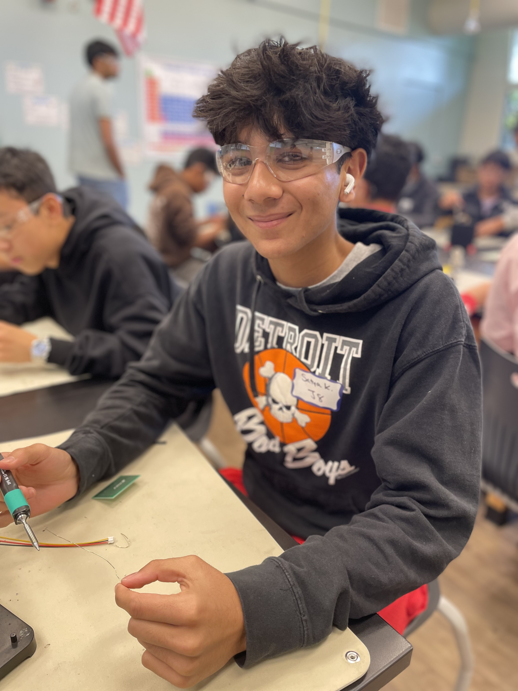

# Ball Tracking Robot
My ball tracking robot uses a camera to detect a red ball and follows it by moving in real time. It processes the camera feed to find the ball’s position and decides whether to move forward, turn left, or turn right based on where the ball is. If the ball isn’t visible, the robot spins in place to search for it again.


| **Engineer** | **School** | **Area of Interest** | **Grade** |
|:--:|:--:|:--:|:--:|
| Satya K. | Northville High School | Electrical Engineering | Incoming Junior


  
# Final Milestone

For my final milestone, I combined all the motor and camera code so that the robot could smoothly track and follow a red ball on its own. This step was all about getting everything to flow together in real time. At first, I had a frustrating problem: the robot would move forward for a second, then randomly spin, then go forward again, and repeat. I realized this was happening because the ball’s position wasn’t being updated often enough, so the robot kept losing track of it and switching into "search mode." To fix this, I rewrote the code so that the camera constantly refreshed and checked for the ball’s position during every part of the movement.

The code begins by setting up the PiCamera to capture live images and initializing all the motor pins using GPIO. I created custom functions like `forward()`, `leftturn()`, `rightturn()`, and `stop()` to control how the robot moves. The most important part is the `find_ball()` function. It takes an image from the camera, converts it to HSV (which makes detecting red easier), filters for red using a mask, and then finds the biggest red shape on the screen. It calculates the center of that shape so the robot knows where the ball is. In the main loop, the robot checks the ball’s x-position: if it’s in the center of the screen, it moves forward; if it’s off to one side, it turns until the ball is centered. If the ball disappears, the robot spins to look for it. I made sure `find_ball()` is called constantly during each of these steps so the robot always knows what’s happening. Once I made that change, the robot finally moved smoothly and kept following the ball without stopping or glitching. This milestone was really exciting because it meant I had fully finished the brain of the robot, and everything was finally working together.


<iframe width="560" height="315" src="https://www.youtube.com/embed/O6RF35PxlI4?si=gt7fKRwOhrS0bdxz" title="YouTube video player" frameborder="0" allow="accelerometer; autoplay; clipboard-write; encrypted-media; gyroscope; picture-in-picture; web-share" referrerpolicy="strict-origin-when-cross-origin" allowfullscreen></iframe>


# Second Milestone

For my second milestone, I finished writing all the code that controls my ball tracking robot. This was a really big deal for me because I had never coded before, and I had to learn everything from scratch. At first, I didn’t understand how to make the robot move or how the camera could detect a ball, but I kept researching, testing, and learning what each part of the code actually did. There are a few main parts in my code. First, I set up the camera using PiCamera2 so it can constantly take pictures of what’s in front of the robot. Then I used OpenCV to process those images. I converted the images to HSV color, which made it easier to detect red, and then I used masking to find only the red areas in the picture. After that, I found the contours of the red object and figured out the center and size of the ball. I also created different functions to move the motors in different directions, like forward, left, right, and stop. Finally, in the main loop, the robot uses the ball’s position to decide what to do—if the ball is centered, it drives forward; if the ball is on the left or right, it turns until the ball is centered again. If it can’t see the ball, it spins in place to search for it. Writing this code was definitely one of the hardest parts of the project, but also the most fun and rewarding, because now my robot can actually see and follow a red ball on its own—and I understand how it all works.


<iframe width="560" height="315" src="https://www.youtube.com/embed/wrUXDa5EN08?si=n9cLEHzhw59oGwR8" title="YouTube video player" frameborder="0" allow="accelerometer; autoplay; clipboard-write; encrypted-media; gyroscope; picture-in-picture; web-share" referrerpolicy="strict-origin-when-cross-origin" allowfullscreen></iframe>


# Milestone 1: Chassis Assembly and Wiring Completed
For the first milestone of my ball tracking robot project, I focused on building the chassis and wiring all the essential components.

Chassis Setup
I assembled a transparent acrylic chassis that holds two yellow DC gear motors for movement and a battery pack to power the system. The structure is lightweight and sturdy, designed to carry all electronics securely.

Electronics and Wiring
I connected the motors to an L298N motor driver, which allows for direction and speed control via GPIO pins on a Raspberry Pi 4. I also wired an HC-SR04 ultrasonic sensor to the Pi for obstacle detection, mounted on a breadboard along with jumper wires for easy prototyping.

Camera Integration
A Raspberry Pi Camera Module is attached via a ribbon cable and will later be used for ball tracking through computer vision.

With the chassis assembled and all electronics wired up, the robot is now ready for programming and sensor testing in the next phase

<iframe width="560" height="315" src="https://www.youtube.com/embed/0V2S65AZBQQ?si=xxf8z3XwhUdGQnZP" title="YouTube video player" frameborder="0" allow="accelerometer; autoplay; clipboard-write; encrypted-media; gyroscope; picture-in-picture; web-share" referrerpolicy="strict-origin-when-cross-origin" allowfullscreen></iframe>


# Schematics 


# Code


```py

import time
import cv2
import numpy as np
from picamera2 import Picamera2
import RPi.GPIO as GPIO

# Initialize Picamera2
picamera = Picamera2()
picamera.configure(picamera.create_preview_configuration(main={"size": (640, 480)}))
picamera.start()

GPIO.setmode(GPIO.BCM)

global thold_val
global H_val
global center
H_val = 0
thold_val = 0
# Empty callback function for slider updates
def Hval_trackbar(val):

    H_val = val

def thold_trackbar(val):
    thold_val = val


def color_subtract(img, color):
    image_HSV = cv2.cvtColor(img, cv2.COLOR_BGR2HSV) #converts image from BGR to HSV
    image_HSV = image_HSV[:,:,0] #gets rid of everything besides the Hue
    image_HSV = np.asarray(image_HSV,np.int16) #turns every pixel number to an integer that can also go negative
    image_HSV = abs(image_HSV - color) #turns the values absolute value
    image_HSV = np.asarray(image_HSV,np.uint8) #it turns it into Opencv format
    return image_HSV

#MOTORS
motor1B = 6  # LEFT motor
motor1E = 5

motor2B = 22  # RIGHT motor
motor2E = 23

en_a = 25  # Analog pins to control speed UNDERSTAND HOW THIS WORKS
en_b = 24

# Set all motors to outputs
GPIO.setup(motor1B, GPIO.OUT)
GPIO.setup(motor1E, GPIO.OUT)
GPIO.setup(motor2B, GPIO.OUT)
GPIO.setup(motor2E, GPIO.OUT)

GPIO.setup(en_a, GPIO.OUT)
GPIO.setup(en_b, GPIO.OUT)

power_a = GPIO.PWM(en_a, 100)
power_a.start(70)

power_b = GPIO.PWM(en_b, 100)
power_b.start(70)

def forward():
    print("moving f")
    GPIO.output(motor1B, GPIO.HIGH)
    GPIO.output(motor1E, GPIO.LOW)
    GPIO.output(motor2B, GPIO.HIGH)
    GPIO.output(motor2E, GPIO.LOW)

def reverse():
    GPIO.output(motor1B, GPIO.HIGH)
    GPIO.output(motor1E, GPIO.LOW)
    GPIO.output(motor2B, GPIO.HIGH)
    GPIO.output(motor2E, GPIO.LOW)

def leftturn():
    print("turning left")
    GPIO.output(motor1B, GPIO.LOW)
    GPIO.output(motor1E, GPIO.LOW)
    GPIO.output(motor2B, GPIO.HIGH)
    GPIO.output(motor2E, GPIO.LOW)

def rightturn():
    print("turning right")
    GPIO.output(motor1B, GPIO.HIGH)
    GPIO.output(motor2B, GPIO.LOW)
    GPIO.output(motor2E, GPIO.LOW)
    GPIO.output(motor1E, GPIO.LOW)


def stop():
    GPIO.output(motor1B, GPIO.LOW)
    GPIO.output(motor1E, GPIO.LOW)
    GPIO.output(motor2B, GPIO.LOW)
    GPIO.output(motor2E, GPIO.LOW)

def sharp_left():
    GPIO.output(motor1B, GPIO.HIGH)
    GPIO.output(motor1E, GPIO.LOW)
    GPIO.output(motor2B, GPIO.LOW)
    GPIO.output(motor2E, GPIO.HIGH)

def sharp_right():
    GPIO.output(motor1B, GPIO.LOW)
    GPIO.output(motor1E, GPIO.HIGH)
    GPIO.output(motor2B, GPIO.HIGH)
    GPIO.output(motor2E, GPIO.LOW)

def back_left():
    GPIO.output(motor1B, GPIO.HIGH)
    GPIO.output(motor1E, GPIO.HIGH)
    GPIO.output(motor2B, GPIO.HIGH)
    GPIO.output(motor2E, GPIO.LOW)

def back_right():
    GPIO.output(motor1B, GPIO.HIGH)
    GPIO.output(motor1E, GPIO.LOW)
    GPIO.output(motor2B, GPIO.HIGH)
    GPIO.output(motor2E, GPIO.HIGH)
def find_ball(): # takes in nothing --> captures a picture aka change the variable center
        global center
        frame = picamera.capture_array()

        # Convert frame to HSV color space
        hsv = cv2.cvtColor(frame, cv2.COLOR_BGR2HSV)

        # Define lower and upper bounds for red color detection in HSV
        lower_red = np.array([120, 120, 120])
        upper_red = np.array([180, 255, 255])

        # Threshold the HSV image to get only red colors
        mask = cv2.inRange(hsv, lower_red, upper_red)
    
        # Apply a series of erosions and dilations to reduce noise
        mask = cv2.erode(mask, None, iterations=2)
        mask = cv2.dilate(mask, None, iterations=2)
        #convert to binaryimage

        contours, _ = cv2.findContours(mask.copy(), cv2.RETR_EXTERNAL, cv2.CHAIN_APPROX_SIMPLE)

    # Initialize center of the ball as None
        center = None
    # Proceed if at least one contour was found
        if len(contours) > 0:
        # Find the largest contour (assuming it's the ball)
            c = max(contours, key=cv2.contourArea)

        # Compute the minimum enclosing circle and centroid
            ((x, y), radius) = cv2.minEnclosingCircle(c)
            M = cv2.moments(c)
            center = (int(M["m10"] / M["m00"]), int(M["m01"] / M["m00"])) # [0][:]
            #x=center[0]
            #print((x,y), radius)
        # Only proceed if the radius meets a minimum size
            if radius > 20:
            # Draw the circle and centroid on the frame
                print(radius)
                cv2.circle(mask, (int(x), int(y)), int(radius), (255, 0, 0), 2)  # Red circle around the detected object
                cv2.putText(mask, "Red Ball", (int(x - radius), int(y - radius)), cv2.FONT_HERSHEY_SIMPLEX, 0.6, (255, 0, 0), 2)
        # Display the frame with detection (might need to look up displaying a binary img)
        cv2.imshow('Frame', mask) #pulls up the window

try:
    while True:
        # Capture frame-by-frame
        find_ball()
        while center:
            stop()
            power_a.ChangeDutyCycle(5)
            power_b.ChangeDutyCycle(5)

            while center and center[0] in range(280,360):
                power_a.ChangeDutyCycle(5)
                power_b.ChangeDutyCycle(5)
                forward()
                forward()
                forward()
                forward()
                find_ball() # capture another picture and then continue forward
            power_a.ChangeDutyCycle(5)
            power_b.ChangeDutyCycle(5)

                

            find_ball()
            while center and center[0] <280:
                find_ball()
                leftturn()
            find_ball()
            while center and center[0] >360:
                find_ball()
                rightturn()
            
            
        if not center:
            find_ball()
            stop()
            power_a.ChangeDutyCycle(1)
            power_b.ChangeDutyCycle(1)
            leftturn()
        

         # Exit if 'q' is pressed
        if cv2.waitKey(1) & 0xFF == ord('q'):
            break

finally:
    cv2.destroyAllWindows()
    picamera.stop()
```

| **Part** | **Note** | **Price** | **Link** |
|:--:|:--:|:--:|:--:|
| Raspberri Pi 4 Model B | Minicomputer used to write code and control the robot | $79.97 | <a href="https://www.amazon.com/Raspberry-Model-2019-Quad-Bluetooth/dp/B07TC2BK1X?source=ps-sl-shoppingads-lpcontext&ref_=fplfs&smid=A2QE71HEBJRNZE&th=1"> <ins>Link</ins> </a> |
|:--:|:--:|:--:|:--:|
| Raspberry Pi Camera Module | The camera used for live video capture. | $14.99 | <a href="https://www.amazon.com/Arducam-Autofocus-Raspberry-Motorized-Software/dp/B07SN8GYGD/ref=sr_1_5?crid=3236VFT39VAPQ&keywords=picamera&qid=1689698732&s=electronics&sprefix=picamer%2Celectronics%2C138&sr=1-5"> <ins>Link</ins> </a> |
|:--:|:--:|:--:|:--:|
| L298N Driver Board | Basic motor driver board which drives the wheels forward and backward. | $8.99 | <a href="https://www.amazon.com/Qunqi-2Packs-Controller-Stepper-Arduino/dp/B01M29YK5U/ref=sr_1_1_sspa?crid=3DE9ZH0NI3KJX&keywords=l298n&qid=1689698859&s=electronics&sprefix=l298n%2Celectronics%2C164&sr=1-1-spons&sp_csd=d2lkZ2V0TmFtZT1zcF9hdGY&psc=1"> <ins>Link</ins> </a> |
|:--:|:--:|:--:|:--:|
| Motors and Board kit | Basic hardware pieces for structural assembly of the robot. | $13.59 | <a href="https://www.amazon.com/Smart-Chassis-Motors-Encoder-Battery/dp/B01LXY7CM3/ref=sr_1_4?crid=27ACD61NPNLO4&keywords=robot+car+kit&qid=1689698962&s=electronics&sprefix=robot+car+kit%2Celectronics%2C169&sr=1-4"> <ins>Link</ins> </a> |
|:--:|:--:|:--:|:--:|
| Powerbank | Compact and portable external power supply with USB-C for Raspberry Pi | $21.98 | <a href="https://www.amazon.com/Anker-Ultra-Compact-High-Speed-VoltageBoost-Technology/dp/B07QXV6N1B/ref=sr_1_1_sspa?crid=53ULGW8ZNDOW&keywords=power+bank&qid=1689699045&s=electronics&sprefix=power+bank%2Celectronics%2C144&sr=1-1-spons&sp_csd=d2lkZ2V0TmFtZT1zcF9hdGY&psc=1"> <ins>Link</ins> </a> |
|:--:|:--:|:--:|:--:|
| HC-SR04 sensors (5 pcs) | Used for distance calculations of unwanted obstacles or objects. | $8.99 | <a href="https://www.amazon.com/Organizer-Ultrasonic-Distance-MEGA2560-ElecRight/dp/B07RGB4W8V/ref=sr_1_2?crid=UYI359LWAAVU&keywords=hc+sr04+ultrasonic+sensor+3+pc&qid=1689699122&s=electronics&sprefix=hc+sr04+ultrasonic+sensor+3+pc%2Celectronics%2C123&sr=1-2"> <ins>Link</ins> </a> |
|:--:|:--:|:--:|:--:|
| HDMI to micro HDMI cable | Used to display Pi contents on monitor. | $8.99 | <a href="https://www.amazon.com/UGREEN-Adapter-Ethernet-Compatible-Raspberry/dp/B06WWQ7KLV/ref=sr_1_5?crid=3S06RDX7B1X4O&keywords=hdmi+to+micro+hdmi&qid=1689699482&s=electronics&sprefix=hdmi+to+micro%2Celectronics%2C132&sr=1-5"> <ins>Link</ins> </a> |
|:--:|:--:|:--:|:--:|
| Video Capture card | Capture card is necessary to display onto laptops (unnecessary for separate monitors). | $16.98 | <a href="https://www.amazon.com/Capture-Streaming-Broadcasting-Conference-Teaching/dp/B09FLN63B3/ref=sr_1_3?crid=19YSORXLTIALH&keywords=video+capture+card&qid=1689699799&s=electronics&sprefix=video+capture+car%2Celectronics%2C140&sr=1-3"> <ins>Link</ins> </a> |
|:--:|:--:|:--:|:--:|
| SD card reader | Necessary to flash your microSD and install an OS onto it. | $4.99 | <a href="https://www.amazon.com/Reader-Adapter-Camera-Memory-Wansurs/dp/B0B9QZ4W4Y/ref=sr_1_4?crid=F124KSQOC5SO&keywords=sd+card+reader&qid=1689869007&sprefix=sd+card+reader%2Caps%2C126&sr=8-4"> <ins>Link</ins> </a> |
|:--:|:--:|:--:|:--:|
| Wireless Mouse and Keyboard | A separate Mouse and Keyboard is needed to operate the Raspberry Pi. | $25.99 | <a href="https://www.amazon.com/Wireless-Keyboard-Trueque-Cordless-Computer/dp/B09J4RQFK7/ref=sr_1_1_sspa?crid=2R048HRMFBA7Z&keywords=mouse+and+keyboard+wireless&qid=1689871090&sprefix=mouse+and+keyboard+wireless+%2Caps%2C131&sr=8-1-spons&sp_csd=d2lkZ2V0TmFtZT1zcF9hdGY&psc=1"> <ins>Link</ins> </a> |
|:--:|:--:|:--:|:--:|
| Basic connections components kit | This includes necessary components for connections such as: breadboard, jumper wires (male-to-male and male-to-female), resistors, and LEDs.  | $11.47 | <a href="https://www.amazon.com/Smraza-Breadboard-Resistors-Mega2560-Raspberry/dp/B01HRR7EBG/ref=sr_1_16?crid=27G99F3EADUCG&keywords=breadboard+1+pc&qid=1689894556&sprefix=breadboard+1+p%2Caps%2C185&sr=8-16"> <ins>Link</ins> </a> |
|:--:|:--:|:--:|:--:|
| Female to Female Jumper Wires | Jumper wires that are necessary for sensor and input motor connections (not included in connections kit above). | $7.98 | <a href="https://www.amazon.com/EDGELEC-Breadboard-1pin-1pin-Connector-Multicolored/dp/B07GCY6CH7/ref=sr_1_3?crid=3C4YB6HOGZ8ZQ&keywords=female%2Bto%2Bfemale%2Bjumper&qid=1689894791&s=electronics&sprefix=female%2Bto%2Bfemale%2Bjumper%2Celectronics%2C161&sr=1-3&th=1"> <ins>Link</ins> </a> |
|:--:|:--:|:--:|:--:|
| Soldering Kit | Soldering kit for motor connections (and solderable breadboard, optional).  | $13.59 | <a href="https://www.amazon.com/Soldering-Interchangeable-Adjustable-Temperature-Enthusiast/dp/B087767KNW/ref=sr_1_5?crid=1QYWI5SBQAPH0&keywords=soldering+kit&qid=1689900771&sprefix=soldering+kit%2Caps%2C169&sr=8-5"> <ins>Link</ins> </a> |
|:--:|:--:|:--:|:--:|

  # Starter Project

For my project, I’m building a mini retro game console using a hardware kit. It includes a pre-programmed PCB, buttons, resistors, a screen, and other components that I’ll solder onto the board. So far, I’ve reviewed the instructions and identified each part. A future challenge will be learning to solder accurately, but I plan to practice and follow each step carefully to complete the build and get the game running. Since my previous milestone, I’ve soldered several key components onto the PCB, including resistors, buttons, and the screen. This was my first time soldering, and I was surprised by how precise and steady-handed the process needs to be. At first, I struggled with getting clean connections, but after some practice, my technique improved. Before the final milestone, I need to finish soldering the remaining components and test the board to ensure the game runs properly. Since my previous milestone, I fully assembled the retro game console by successfully soldering all components to the PCB. One of my biggest challenges at BSE was learning to solder precisely, but completing the project without errors felt like a huge win. I gained hands-on experience with circuit boards, hardware assembly, and how code interacts with electronics. Moving forward, I hope to learn more about how to write and upload code to microcontrollers, and eventually design my own circuits from scratch
 (1).png)

<iframe width="560" height="315" src="https://www.youtube.com/embed/hpA1Lo974hc?si=MfsmtxrMitbGTFqL" title="YouTube video player" frameborder="0" allow="accelerometer; autoplay; clipboard-write; encrypted-media; gyroscope; picture-in-picture; web-share" referrerpolicy="strict-origin-when-cross-origin" allowfullscreen></iframe>
