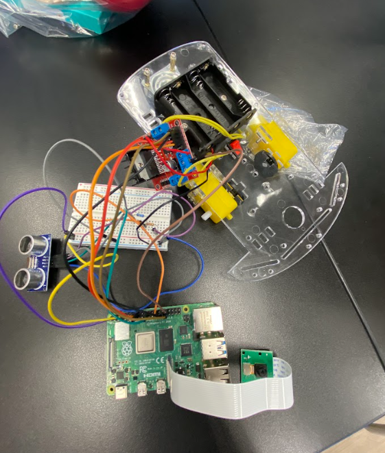
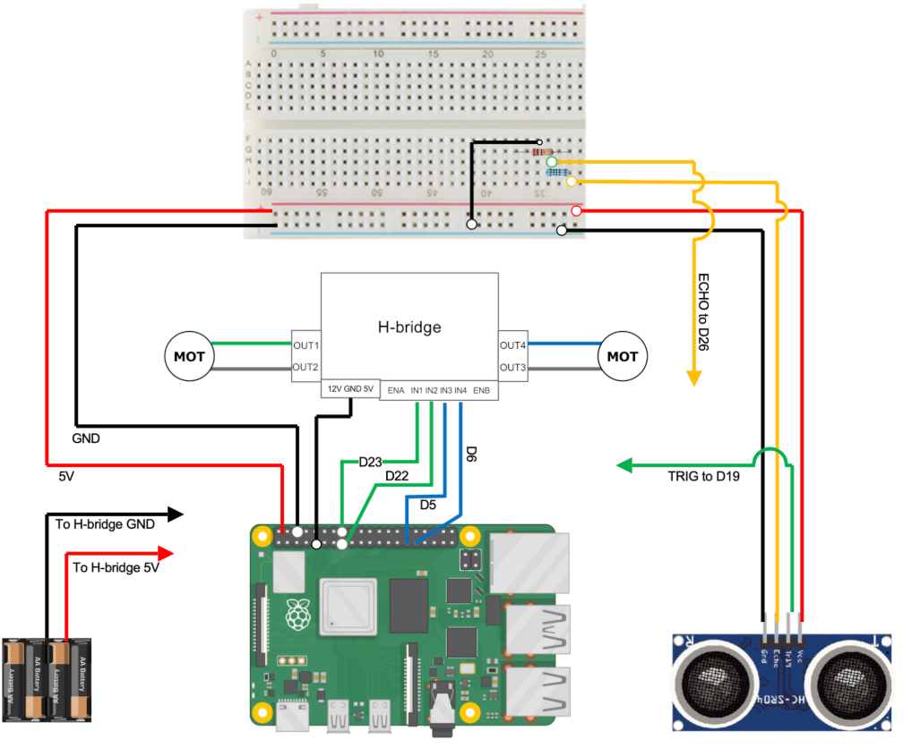

# Ball Tracking Robot
I built a mini retro game console by assembling a hardware kit with a pre-programmed PCB. Soldering each component was a fun challenge, and seeing the game come to life on the screen was incredibly rewarding. This project taught me attention to detail and the basics of electronics assembly

You should comment out all portions of your portfolio that you have not completed yet, as well as any instructions:
```HTML 
<!--- This is an HTML comment in Markdown -->
<!--- Anything between these symbols will not render on the published site -->
```

| **Engineer** | **School** | **Area of Interest** | **Grade** |
|:--:|:--:|:--:|:--:|
| Satya K. | Northville High School | Electrical Engineering | Incoming Junior


  
# Final Milestone

**Don't forget to replace the text below with the embedding for your milestone video. Go to Youtube, click Share -> Embed, and copy and paste the code to replace what's below.**

<iframe width="560" height="315" src="https://www.youtube.com/embed/F7M7imOVGug" title="YouTube video player" frameborder="0" allow="accelerometer; autoplay; clipboard-write; encrypted-media; gyroscope; picture-in-picture; web-share" allowfullscreen></iframe>


# Second Milestone

**Don't forget to replace the text below with the embedding for your milestone video. Go to Youtube, click Share -> Embed, and copy and paste the code to replace what's below.**

<iframe width="560" height="315" src="https://www.youtube.com/embed/y3VAmNlER5Y" title="YouTube video player" frameborder="0" allow="accelerometer; autoplay; clipboard-write; encrypted-media; gyroscope; picture-in-picture; web-share" allowfullscreen></iframe>


# Milestone 1: Chassis Assembly and Wiring Completed
For the first milestone of my ball tracking robot project, I focused on building the chassis and wiring all the essential components.

Chassis Setup
I assembled a transparent acrylic chassis that holds two yellow DC gear motors for movement and a battery pack to power the system. The structure is lightweight and sturdy, designed to carry all electronics securely.

Electronics and Wiring
I connected the motors to an L298N motor driver, which allows for direction and speed control via GPIO pins on a Raspberry Pi 4. I also wired an HC-SR04 ultrasonic sensor to the Pi for obstacle detection, mounted on a breadboard along with jumper wires for easy prototyping.

Camera Integration
A Raspberry Pi Camera Module is attached via a ribbon cable and will later be used for ball tracking through computer vision.

With the chassis assembled and all electronics wired up, the robot is now ready for programming and sensor testing in the next phase




# Schematics 



# Code
Here's where you'll put your code. The syntax below places it into a block of code. Follow the guide [here]([url](https://www.markdownguide.org/extended-syntax/)) to learn how to customize it to your project needs. 

```c++
void setup() {
  // put your setup code here, to run once:
  Serial.begin(9600);
  Serial.println("Hello World!");
}

void loop() {
  // put your main code here, to run repeatedly:

}
```

# Bill of Materials
Here's where you'll list the parts in your project. To add more rows, just copy and paste the example rows below.
Don't forget to place the link of where to buy each component inside the quotation marks in the corresponding row after href =. Follow the guide [here]([url](https://www.markdownguide.org/extended-syntax/)) to learn how to customize this to your project needs. 

| **Part** | **Note** | **Price** | **Link** |
|:--:|:--:|:--:|:--:|
| Item Name | What the item is used for | $Price | <a href="https://www.amazon.com/Arduino-A000066-ARDUINO-UNO-R3/dp/B008GRTSV6/"> Link </a> |
| Item Name | What the item is used for | $Price | <a href="https://www.amazon.com/Arduino-A000066-ARDUINO-UNO-R3/dp/B008GRTSV6/"> Link </a> |
| Item Name | What the item is used for | $Price | <a href="https://www.amazon.com/Arduino-A000066-ARDUINO-UNO-R3/dp/B008GRTSV6/"> Link </a> |

# Other Resources/Examples
One of the best parts about Github is that you can view how other people set up their own work. Here are some past BSE portfolios that are awesome examples. You can view how they set up their portfolio, and you can view their index.md files to understand how they implemented different portfolio components.
- [Example 1](https://trashytuber.github.io/YimingJiaBlueStamp/)
- [Example 2](https://sviatil0.github.io/Sviatoslav_BSE/)
- [Example 3](https://arneshkumar.github.io/arneshbluestamp/)

  # Starter Project

For my project, I’m building a mini retro game console using a hardware kit. It includes a pre-programmed PCB, buttons, resistors, a screen, and other components that I’ll solder onto the board. So far, I’ve reviewed the instructions and identified each part. A future challenge will be learning to solder accurately, but I plan to practice and follow each step carefully to complete the build and get the game running. Since my previous milestone, I’ve soldered several key components onto the PCB, including resistors, buttons, and the screen. This was my first time soldering, and I was surprised by how precise and steady-handed the process needs to be. At first, I struggled with getting clean connections, but after some practice, my technique improved. Before the final milestone, I need to finish soldering the remaining components and test the board to ensure the game runs properly. Since my previous milestone, I fully assembled the retro game console by successfully soldering all components to the PCB. One of my biggest challenges at BSE was learning to solder precisely, but completing the project without errors felt like a huge win. I gained hands-on experience with circuit boards, hardware assembly, and how code interacts with electronics. Moving forward, I hope to learn more about how to write and upload code to microcontrollers, and eventually design my own circuits from scratch
 (1).png)
# Schematics 
Here's where you'll put images of your schematics. [Tinkercad](https://www.tinkercad.com/blog/official-guide-to-tinkercad-circuits) and [Fritzing](https://fritzing.org/learning/) are both great resoruces to create professional schematic diagrams, though BSE recommends Tinkercad becuase it can be done easily and for free in the browser. 

To watch the BSE tutorial on how to create a portfolio, click here.
